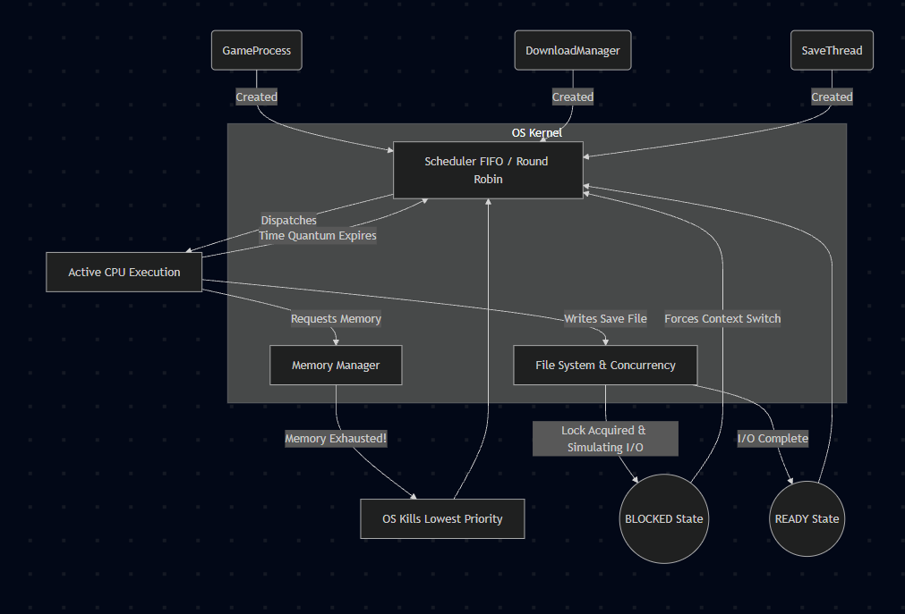
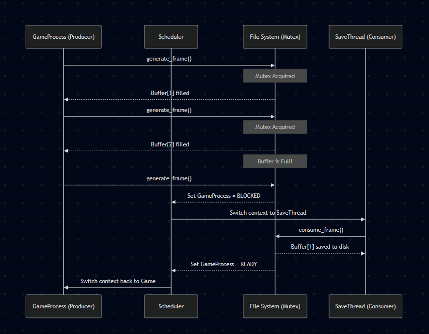

# GameConsoleOS - Final Project Report

## 1. System Overview & Theme
The GameConsoleOS is a specialized mini operating system simulator designed to manage resources for gaming workloads. Because gaming requires high-performance rendering and background state saving without interrupting gameplay, the OS architecture prioritizes strict concurrency controls and non-blocking I/O. The system features a hierarchical file system isolated by component, a round-robin scheduler to maintain UI responsiveness, and a robust memory manager capable of gracefully handling exhaustion under heavy gaming loads.

---

## 2. Architecture Diagram

---

## 3. Key Design Decisions & Alternatives

### 3.1 File System Architecture
**Design Chosen:** For the GameConsoleOS, we implemented a hierarchical, dictionary-based file system (separated into `/system`, `/games`, and `/saves`) featuring explicit file metadata. The storage simulation uses a nested Python dictionary where keys represent directory paths and values store the File objects, allowing for O(1) time complexity during simulated I/O. Every file object (File Control Block) requires three exact attributes: `name`, `data` (string payload), and `is_locked` (boolean).

**Alternative Considered:** We considered a flat file system architecture where all simulated files are stored in a single, unstructured list or dictionary without subdirectories.

**Justification & Trade-off:** The flat architecture was rejected because it lacks the realistic isolation required for a modern gaming console, where system logs must be strictly separated from user save data. By choosing the hierarchical approach with built-in metadata, we traded the simplicity and speed of coding a flat structure for enhanced system realism, better data organization, and a native mechanism to track file-level locks during concurrent operations.

### 3.2 Concurrency & Synchronization
**Design Chosen:** To manage background saving without corrupting game data, we implemented a Producer-Consumer architecture utilizing a shared Python list acting as a bounded buffer (maximum capacity of 5 slots). This buffer is secured by a single Mutex lock and Condition Variables. Strict synchronization rules are enforced:
* **Producer (Render Thread):** Must acquire the Mutex before writing. If the buffer is full, it releases the Mutex and waits.
* **Consumer (Save Thread):** Must acquire the Mutex before reading. If the buffer is empty, it releases the Mutex and waits.

**Alternative Considered:** We considered using an unbounded (infinite) buffer list, or utilizing a simple polling mechanism (busy-waiting) where the threads constantly burn CPU cycles checking if the buffer is ready.

**Justification & Trade-off:** The unbounded buffer was rejected due to the risk of memory exhaustion if the render thread drastically outpaced the slow save thread. Busy-waiting was rejected because it wastes CPU cycles needed by the game. We accepted a trade-off in system throughput—our fast render thread must occasionally halt and block when the bounded buffer fills up—but in exchange, we guarantee 100% data integrity, prevent memory overflows, and conserve CPU resources.

---

## 4. Cross-Component Interactions

### 4.1 Scheduler and File I/O Integration
In the GameConsoleOS, subsystems do not operate in isolation. We established a strict cross-component interaction between the File System and the Process Scheduler. 
* **The Interaction:** Hardware I/O operations (like saving a game state) are inherently slower than CPU cycles. When a process initiates a `write_file` command, the File System accesses the running program's Process Control Block (PCB).
* **The State Change:** The File System intercepts the process and explicitly changes its state to `ProcessState.BLOCKED`. The system then simulates a physical write delay.
* **The Scheduling Response:** Safiye's Scheduler immediately detects this state change, removes the blocked process from the active CPU loop, and loads the next `READY` process, ensuring the OS does not freeze during file saves. Once the I/O simulation completes, the state reverts to `READY`.

---

## 5. Engineering Challenge & Failure Scenario

### 5.1 Memory Exhaustion (The Engineering Challenge)
**The Problem:** In a resource-constrained environment like a Game Console, running background tasks (like downloading updates or capturing screenshots) while playing a high-fidelity game can easily consume all available physical memory. If an OS does not anticipate this, attempting to allocate memory beyond the physical limit will cause a system-wide fatal crash.

**Our Solution:** We implemented a priority-based memory exhaustion handler. When a new process requests more memory than is currently available, the Memory Manager intercepts the failure. It communicates with the Process Control Blocks (PCBs) to identify active processes with the lowest priority tier. It then gracefully forces a `TERMINATED` state on that specific low-priority background task, reclaiming its memory pages to satisfy the new allocation request, ensuring the highest priority task (the GameProcess) is never interrupted.

### 5.2 Failure Scenario Demonstration
To demonstrate this safety net, we intentionally overloaded the system. 
1. The OS was loaded with the `GameProcess` (Priority 3), `SaveThread` (Priority 2), and a `DownloadManager` (Priority 1), leaving only 12MB of free RAM.
2. We then attempted to launch the `ScreenshotService` which required 50MB.
3. As shown in our observability logs, the Memory Manager successfully detected the exhaustion condition. It scanned the active PCBs, identified the `DownloadManager` as a non-essential Priority 1 task, and killed it. 
4. The system recovered 100MB of RAM, successfully launched the screenshot tool, and the system stabilized without crashing the primary game loop.

---

## 6. Limitations & Future Improvements

### 6.1 System Limitations Under Double Load
While the GameConsoleOS performs well under baseline conditions, doubling the system workload (e.g., simulating a split-screen multiplayer game that requires double the memory and rendering throughput) exposes two critical bottlenecks:
* **I/O Starvation:** Our Producer-Consumer buffer is strictly bounded to 5 slots. Under double the rendering load, the buffer fills twice as fast. Because the Consumer (simulated hard drive) cannot write faster, the active game process will spend excessive time in the `BLOCKED` state, which would manifest to the user as severe frame-rate drops or stuttering.
* **Aggressive Eviction:** If the primary workload requires an additional 300MB of RAM, the system will permanently exist in a state of memory exhaustion. Our priority-based eviction will systematically terminate all background tasks (downloads, screenshots, social features) to keep the game alive, rendering the console's multitasking features unusable.

### 6.2 Future Improvements
Given more development time, we would implement the following architectural upgrades:
1. **Dynamic Buffer Sizing:** Instead of a hardcoded 5-slot buffer, the OS could monitor memory availability and dynamically expand the `SaveGameBuffer` size during high-render periods to prevent the game thread from blocking.
2. **Multi-Level Feedback Queue (MLFQ):** Replacing our Round Robin scheduler with an MLFQ would allow the OS to auto-detect I/O-bound processes (like the Save Thread) and automatically boost their priority, helping to clear the concurrency buffer faster without manual priority assignments.
